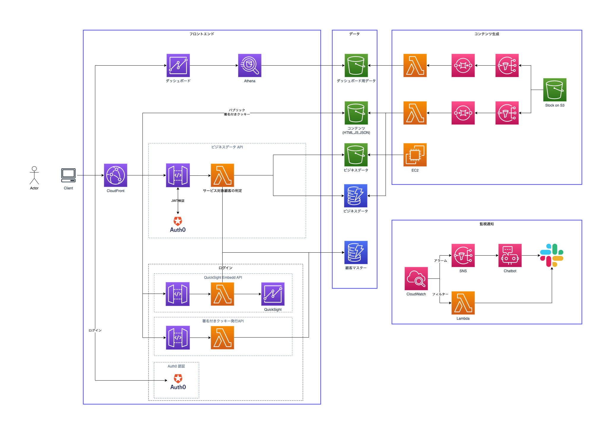

# Deploy Procedure

## Preparation
AWS CLI/AWS SAM CLI/jq/Dockerがインストールされていること

## Diagram


## Setup
### パラメータ定義
- グローバル定義
  `/path/to/env_params/env.json`に適切な値を設定
  ```json
  {
      "Exports": {
          "Planning": "mi",
          "Project": "mi-template",
          "ProfilePrefix": "mi",
          "DeployRegion": "ap-northeast-1"
      },
      "Parameters": {
          "Region": "ane1"
      },
      "Tags": {
          "Cost": "template"
      }
  }
  ```

- MAP2.0
  `/path/to/***/cfn_params/param_(dev|stg|prd).json`の`map-migrated`の値を設定

### アカウント設定
- API GatewayのIAM
  ※ 設定済みの場合はスキップ
  ```
  cd /path/to/cfn/account/account-config
  ./deploy.sh (dev|prd)
  ```

- Slack Workspace
  コンソールから設定する

### 外部認証情報の登録
```
cd /path/to/cfn/infra/infra-resource
./put_ssm.sh (dev|stg|prd) <キー名> <値>
```

必須登録項目
Key|Description
---|-----------
auth0/domain|auth0のドメイン
auth0/client-id|auth0のクライアントID
auth0/identifier|auth0のAPI ID
slack/workspace-id|AWSに登録したSlackのワークスペースID
slack/channel-id/alarm|CloudWatch Alarm経由で送信するSlackチャンネル
slack/channel-id/logs|CloudWatch Logs経由で送信するSlackチャンネル
slack/oauth-token|Slack連携用のトークン
mapbox/access-token|Mapboxのアクセストークン

### CloudFrontの公開鍵、キーグループ登録
```
cd /path/to/cfn/infra/infra-keypair
./put_keypair.sh (dev|stg|prd)
./deploy.sh (dev|stg|prd)
```

### CI-CD環境の構築
```
cd /path/to/cfn/infra/infra-cicd
./deploy.sh (dev|stg|prd)
```

### 共通IAM/セキュリティグループの作成
```
cd /path/to/cfn/infra/infra-security
./deploy.sh (dev|stg|prd)
```

### Slack通知用トピックの作成
```
cd /path/to/cfn/alert/alert-topic
./deploy.sh (dev|stg|prd) ane1
./deploy.sh (dev|stg|prd) use1
```

### Chatbotの構築
```
cd /path/to/cfn/alert/alert-chatbot
./deploy.sh (dev|stg|prd)
```

### Slack通知用Lambdaの構築
```
cd /path/to/cfn/alert/alert-slack
./upload_to_pipeline.sh (dev|stg|prd)
./deploy_pipeline.sh (dev|stg|prd)
```

- AWSコンソールで対象のCodePipelineを開き、承認
- デプロイ完了後
  ```
  ./add_tag.sh (dev|stg|prd)
  ```

### DBの作成
- ユーザ
  ```
  cd /path/to/cfn/store/store-user
  ./deploy.sh (dev|stg|prd)
  ```

- データ
  ```
  cd /path/to/cfn/store/store-data
  ./deploy.sh (dev|stg|prd)
  ```

### Custom Authorizerの構築
```
# Slack通知用Lambdaの構築と同じ
cd /path/to/cfn/guard/guard-authorizer
./upload_to_pipeline.sh (dev|stg|prd)
./deploy_pipeline.sh (dev|stg|prd)
./add_tag.sh (dev|stg|prd)
```

### WAFの構築
```
# Slack通知用Lambdaの構築と同じ
cd /path/to/cfn/guard/guard-waf
./deploy.sh (dev|stg|prd)
```

### 署名付きCookie生成APIの構築
```
# Slack通知用Lambdaの構築と同じ
cd /path/to/cfn/api/api-authorizer
./upload_to_pipeline.sh (dev|stg|prd)
./deploy_pipeline.sh (dev|stg|prd)
./add_tag.sh (dev|stg|prd)
```

### APIの構築
- QuickSight
  ```
  # Slack通知用Lambdaの構築と同じ
  cd /path/to/cfn/api/api-quicksight
  ./upload_to_pipeline.sh (dev|stg|prd)
  ./deploy_pipeline.sh (dev|stg|prd)
  ./add_tag.sh (dev|stg|prd)
  ```

- S3 Proxy
  ```
  # Slack通知用Lambdaの構築と同じ
  cd /path/to/cfn/api/api-s3proxy
  ./upload_to_pipeline.sh (dev|stg|prd)
  ./deploy_pipeline.sh (dev|stg|prd)
  ./add_tag.sh (dev|stg|prd)
  ```

### データ処理の構築
- Stock on S3
  ```
  # Slack通知用Lambdaの構築と同じ
  cd /path/to/cfn/data/data-holiday
  ./upload_to_pipeline.sh (dev|stg|prd)
  ./deploy_pipeline.sh (dev|stg|prd)
  ./add_tag.sh (dev|stg|prd)
  ```

- スケジュール
  ```
  # Slack通知用Lambdaの構築と同じ
  cd /path/to/cfn/data/data-schedule
  ./upload_to_pipeline.sh (dev|stg|prd)
  ./deploy_pipeline.sh (dev|stg|prd)
  ./add_tag.sh (dev|stg|prd)
  ```

### CloudFrontのデプロイ
```
cd /path/to/cfn/hosting/hosting-cloudfront
./deploy.sh (dev|stg|prd)
./put_id.sh (dev|str|prd)
```

### CloudFrontのメトリクス設定
```
cd /path/to/cfn/hosting/hosting-cloudfront-metrics
./deploy.sh (dev|stg|prd)
```

### HTMLのデプロイ
```
cd /path/to/cfn/site/site-web
./upload_to_pipeline.sh (dev|stg|prd) template
./deploy_pipeline.sh (dev|stg|prd)
```

## CloudFormationのデプロイ先
Category|Name|Region
--------|----|------
account|account-config|ane1
alert|alert-chatbot|ane1
alert|alert-slack|ane1
alert|alert-topic|ane1/use1
api|api-authorizer|ane1
api|api-quicksight|ane1
api|api-s3proxy|ane1
data|data-holiday|ane1
data|data-schedule|ane1
guard|guard-authorizer|ane1
guard|guard-waf|ane1
hosting|hosting-authorizer|ane1
hosting|hosting-cloudfront|ane1
hosting|hosting-cloudfront-metrics|use1
infra|infra-cicd|ane1
infra|infra-keypair|ane1
infra|infra-resource|ane1
infra|infra-security|ane1
site|site-web|ane1
store|store-data|ane1
store|store-user|ane1
