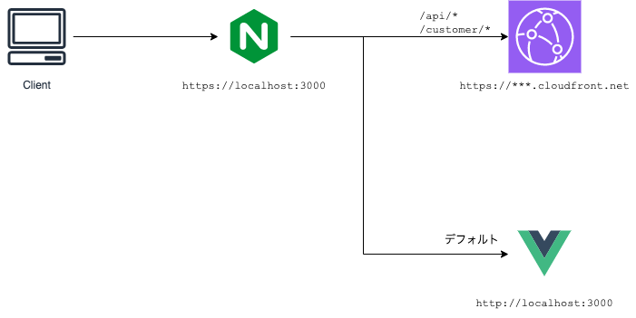

# Deploy Procedure

## Preparation
Docker/Mutagen(Mutage Compose)/mkcertがインストールされていること

## Diagram


## Setup
### 自己認証書の作成
- 自己認証局の登録
  ```
  mkcert -install
  ```

- 自己証明書の作成
  ```
  mkcert \
    -cert-file /path/to/docker/certs/localhost.pem \
    -key-file /path/to/docker/certs/localhost-key.pem \
    dev.localhost localhost 127.0.0.1 ::1
  ```

### 開発コンテナのビルド
```
cd /path/to/docker
docker build -t weathernews/with-develop:latest .
```

### 環境変数ファイルの配置
```
cd /path/to
cp .env.template .env
```

`.env`の中身に適切な値を設定する

Key|Description
---|-----------
CLOUD_FRONT_DOMAIN|開発中に利用するCloudFrontのドメイン（`https://`は含めない）

### コンテナの立ち上げ
```
cd /path/to
mutagen-compose up -d
```

### 開発環境の立ち上げ
VSCodeで`/path/to`ディレクトリを開き、`Open Folder in Container`を実行する

VSCodeコンテナ内で、
``` 
cd cfn/site/site-web/src/template/
npm install (必要に応じて)
npm run dev
https://dev.localhost:3000/
```

## Customize
### ランタイムのバージョンを変更する
`/path/to/docker/Dockerfile`を編集し、コンテナを再ビルドする

- Python
  ```
  # 1行目
  FROM python:3.X.X-bullseye
  ```

- Golang
  ```
  # 3行目
  ENV GO_VERSION 1.X.X
  ```

- Node.js
  ```
  # 4行目
  ENV NODE_VERSION 16.X.X
  ```

### リバースプロキシするパスを変更する
`/path/to/docker/nginx/localhost.conf.template`を編集し、`nginx`コンテナを再起動する

```
docker compose restart nginx
```
